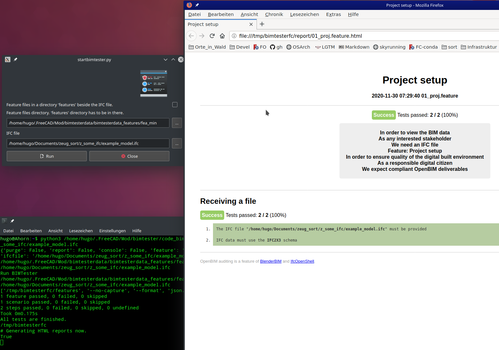

# BIMTester for FreeCAD
### Screen shot

### Installation and run
+ Install BIMTester for FreeCAD via FreeCAD AddOn manager from menu [I]Edit[\I]
+ Install BIMTester suorce code
    + download the ifcbimtester directory from https://github.com/IfcOpenShell/IfcOpenShell/tree/v0.7.0/src/ifcbimtester
    + may be use https://downgit.github.io/#/home?url=https:%2F%2Fgithub.com%2FIfcOpenShell%2FIfcOpenShell%2Ftree%2Fv0.7.0%2Fsrc%2Fifcbimtester
    + paste this directory in FreeCAD_User_Mod/bimtester/ and rename it to code_bimtester
+ Install missing dependencies
    + behave (at least 1.2.6)
    + pystache
    + on Windows this may help: https://forum.freecadweb.org/viewtopic.php?f=4&t=49295
    + ifcopenshell (on FreeCAD for Windows this may included already)
+ start FreeCAD, switch to BIMTester, the Gui will start
+ On the very first start of BIMTester once close the TaskPanel and restart it to initialise the standard directories
+ the ifc file is set to the BIMTester included example
+ click on run
+ :-)
